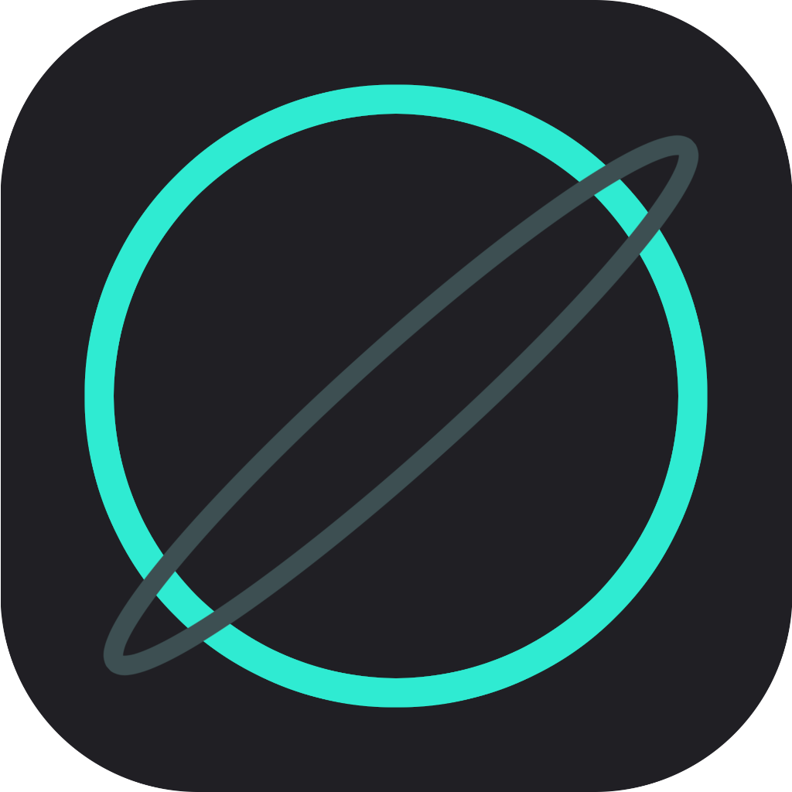
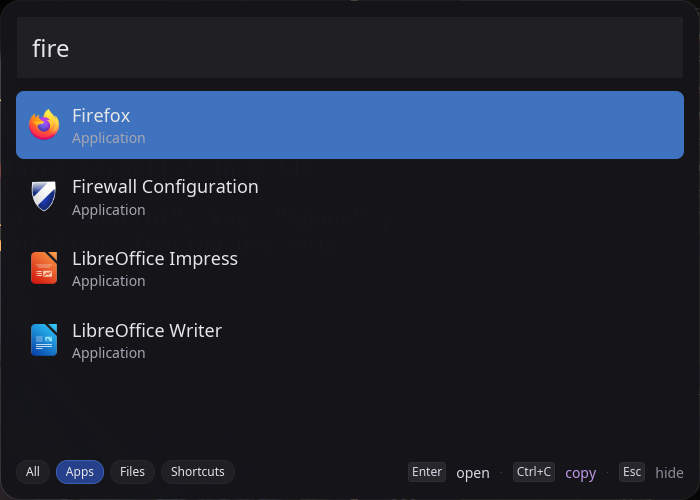

<!-- Header -->
<p align="left">
  
</p>

# NanoCast

**A fast, lightweight, Spotlight/Raycast-inspired popup launcher for Linux and macOS.**

Built with ❤️ in Rust.

---

## Features

- **Lightning fast** fuzzy search powered by `nucleo`
- Global hotkey support (`Ctrl/Cmd + Space` by default)
- Clean, modern translucent UI with blur effect
- Keyboard navigation (`↑↓`, `Enter`, `Esc`)
- Click outside to dismiss
- Supports **Linux `.desktop` files** and **macOS `.app`** applications
- Configurable via TOML
- Starts hidden, low resource usage
- Built with `iced` (Rust native UI)

---

## Screenshots



---

## Installation

### From Source (Recommended for now)

```bash
# Clone the repo
git clone https://github.com/Timebom/nanocast.git
cd nanocast/ui

# Build release version
cargo run

# Run
../target/debug/ui

# Kill/Terminate
ps -ael
kill <nanocast-ps-id>
```

## Usage

1. Run NanoCast (it will start in the background)
2. Press Ctrl + Space (Linux) or Cmd + Space (macOS) to open
3. Type to search applications or files
4. Use arrow keys to navigate
5. Press Enter to launch
6. Press Esc or click outside to close

## Configuration
### Configuration file is located at:

- Linux: ~/.config/nanocast/config.toml
- macOS: ~/Library/Application Support/nanocast/config.toml

## Example ```config.toml```

```toml
max_results = 50

[hotkey]
modifiers = "Control"   # or "Meta" on macOS
key = "Space"

[window]
width = 700
height = 500
blur = true

[index]
index_applications = true
index_files = true
file_paths = ["~/Downloads", "~/Documents"]
```

## Building & Development

```bash
# Run in development mode
cargo run

# Build optimized release
cargo build --release
```

## Roadmap

- [x] Better icon support (system icon themes on Linux)
- [ ] Calculator mode
- [ ] Clipboard history
- [ ] Custom commands / plugins
- [ ] Window blur effects (macOS vibrancy + Linux)
- [ ] Pre-built binaries (AppImage, .dmg)
- [ ] Windows support


## Tech Stack

- Language: Rust
- UI: Iced 0.14
- Search: Nucleo
- Hotkeys: global-hotkey
- Desktop files: freedesktop-file-parser
- Icon Parsing: freedesktop-icons

---

## License

MIT License - feel free to use, modify, and distribute.
