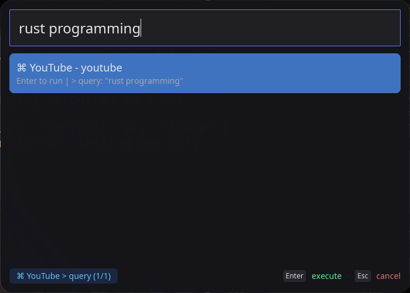
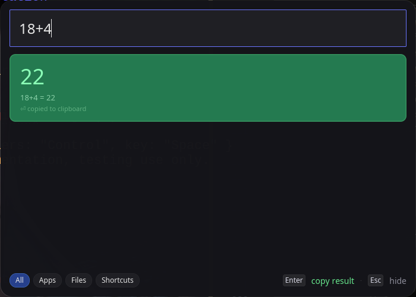

<!-- Header -->
<p align="left">
  
</p>

# NanoCast

**A fast, lightweight, Spotlight/Raycast-inspired popup launcher for Linux and macOS.**

Built with ❤️ in Rust.

---

## Features

- **Lightning fast** fuzzy search powered by `nucleo`
- Global hotkey support (`Ctrl/Cmd + Space` by default)
- Clean, modern UI with rounded corners and blur
- Keyboard navigation (`↑↓`, `Enter`, `Esc`, `Tab`, `Ctrl+C`)
- Filter results by **All / Applications / Files / Shortcuts**
- Mouse support (click to select, double-click to launch, click outside to dismiss)
- Supports **Linux `.desktop` files** and **macOS `.app`** bundles
- Built-in calculator with live preview
- Custom command shortcuts with **command mode** (slot-based input via `> trigger`)
- Clipboard support (copy paths/results with `Ctrl+C`)
- Configurable via TOML
- Starts hidden, low resource usage
- Built with `iced` (Rust native UI)

---

## Screenshots





---

## Installation

### From Source (Recommended)

```bash
# Clone the repo
git clone https://github.com/Timebom/nanocast.git
cd nanocast

# Build and run
cargo run --release
```

## Pre-built Binaries
- Linux: Coming soon
- macOS: Coming soon

## Usage

1. Run NanoCast (it runs in the background)
2. Press **Ctrl** + **Space** (Linux) or **Cmd** + **Space** (macOS) to open
3. Type to search applications, files or commands
4. Use arrow keys or mouse to navigate
5. Press **Enter** to launch / **Ctrl+C** to copy
6. Press **Esc** or click outside to close
7. Use `F1`-`F3` to filter results
8. Type `> trigger` for command mode with slots
9. To quit: Type ```quit```, ```exit```, or ```kill``` and press Enter

## Configuration
### Configuration file is located at:

- Linux: ```~/.config/nanocast/config.toml```
- macOS: ```~/Library/Application Support/nanocast/config.toml```

Run the app once to generate the default config.

## Example ```config.toml```

```toml
max_results = 50

[hotkey]
modifiers = "Control"   # or "Meta" on macOS
key = "Space"

[window]
width = 700
height = 500
blur = true

[index]
index_applications = true
index_files = true
file_paths = ["~/Downloads", "~/Documents"]

[[shortcuts]]
trigger = "youtube"
name = "Youtube"
action_type = "open_url"
command = "https://youtube.com/results?search_query={query}"
```

## Roadmap

- [ ] Clipboard history
- [ ] Window blur effects (macOS vibrancy + Linux)
- [ ] Plugin system
- [ ] Windows support
- [ ] Better theming


## Tech Stack

- Language: Rust
- UI: Iced 0.14
- Search: Nucleo
- Hotkeys: global-hotkey
- Clipboard: arboard
- Calculator: evalexpr

---

## License

MIT License - feel free to use, modify, and distribute.
